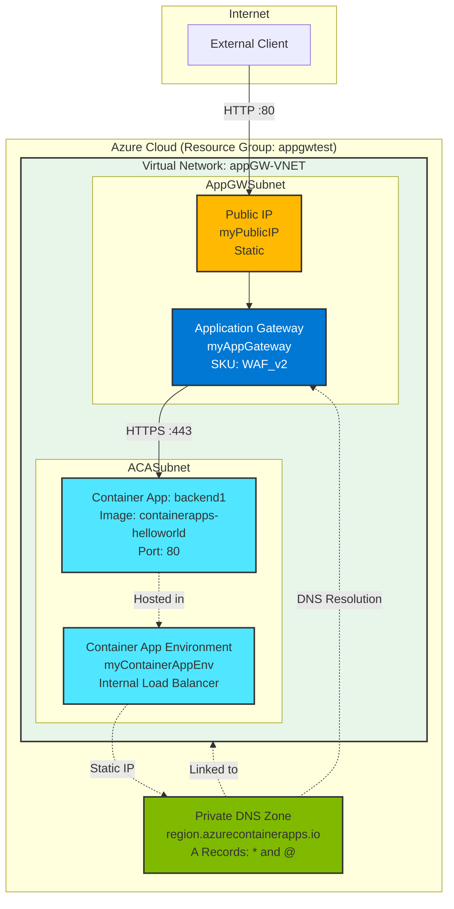

# AppGWprivateACA

This repository provides a Terraform configuration for deploying Azure Container Apps behind an Azure Application Gateway with Web Application Firewall (WAF) protection. The setup uses a private/internal Container App Environment with private DNS resolution.

This repo is based on the [Microsoft Documentation](https://learn.microsoft.com/en-us/azure/container-apps/waf-app-gateway?tabs=default-domain#create-and-configure-an-azure-private-dns-zone).

## Architecture Overview

The following diagram illustrates the complete architecture of this deployment:



## Components Explained

### 1. **Virtual Network (VNet)**
- **Name**: `appGW-VNET`
- **Address Space**: `10.0.0.0/16`
- **Purpose**: Provides network isolation and connectivity for all Azure resources
- **Location**: West Europe

The VNet contains two subnets:

#### a. AppGWSubnet (`10.0.1.0/24`)
- Dedicated subnet for the Application Gateway
- Hosts the Application Gateway and its public IP address
- Private link service network policies are disabled

#### b. ACASubnet (`10.0.2.0/23`)
- Dedicated subnet for the Container App Environment
- Requires a larger address space (minimum /23) for Container Apps infrastructure
- Hosts the internal load balancer and container instances

### 2. **Public IP Address**
- **Name**: `myPublicIP`
- **SKU**: Standard
- **Allocation**: Static
- **Purpose**: Provides the internet-facing endpoint for the Application Gateway
- External clients connect to this IP address to access the application

### 3. **Application Gateway with WAF**
- **Name**: `myAppGateway`
- **SKU**: `WAF_v2` (Web Application Firewall v2)
- **Capacity**: 2 instances
- **Frontend**: 
  - Listens on port 80 (HTTP)
  - Uses the public IP address
- **Backend**: 
  - Connects to the Container App via HTTPS on port 443
  - Uses the Container App's FQDN from the backend address pool
  - Picks hostname from backend address (required for Container Apps)
- **WAF Protection**:
  - Enabled in Prevention mode
  - Uses OWASP rule set version 3.2
  - Protects against common web vulnerabilities (SQL injection, XSS, etc.)

**Traffic Flow**: External clients connect via HTTP on port 80. The Application Gateway then forwards traffic via HTTPS on port 443 to the Container App's FQDN. The Container App Environment provides automatic TLS termination and routes the request to the container application listening on port 80.

### 4. **Container App Environment**
- **Name**: `myContainerAppEnv`
- **Type**: Internal (private)
- **Key Feature**: Internal load balancer enabled
- **Purpose**: Provides the runtime environment for Container Apps with private networking
- **Network**: Integrated with the ACASubnet
- **Static IP**: Assigned for DNS resolution

### 5. **Container App**
- **Name**: `backend1`
- **Image**: `mcr.microsoft.com/azuredocs/containerapps-helloworld:latest`
- **Resources**: 0.25 CPU, 0.5 GiB memory
- **Ingress**: 
  - External enabled (within VNet)
  - Target port: 80
  - Receives traffic from the Application Gateway
- **Revision Mode**: Single (only one revision active at a time)

### 6. **Private DNS Zone**
- **Zone Name**: Dynamically created based on Container App FQDN (e.g., `westeurope.azurecontainerapps.io` for West Europe region)
- **Records**:
  - **Wildcard A Record (`*`)**: Points to the Container App Environment's static IP
  - **Root A Record (`@`)**: Points to the Container App Environment's static IP
- **VNet Link**: Linked to the VNet to enable DNS resolution from the Application Gateway
- **Purpose**: Enables the Application Gateway to resolve the private FQDN of the Container App to its internal IP address

## How It Works

1. **External Access**: An external client sends an HTTP request to the public IP address on port 80

2. **WAF Protection**: The Application Gateway's WAF inspects the request and blocks malicious traffic based on OWASP rules

3. **DNS Resolution**: The Application Gateway resolves the Container App's FQDN using the Private DNS Zone, which returns the internal IP address of the Container App Environment

4. **Secure Forwarding**: The Application Gateway forwards the request via HTTPS (port 443) to the Container App's FQDN

5. **TLS Termination**: The Container App Environment terminates the TLS connection and routes the request to the container application on port 80

6. **Container Processing**: The Container App processes the request and returns the response

7. **Response Path**: The response travels back through the Container App Environment and Application Gateway to the client

## Security Features

- **Web Application Firewall (WAF)**: Protection against OWASP Top 10 vulnerabilities
- **Private Container Apps**: Container Apps are not directly exposed to the internet
- **Network Isolation**: Resources are isolated within a VNet with dedicated subnets
- **HTTPS Backend**: Encrypted communication between Application Gateway and Container Apps
- **Private DNS**: Internal name resolution prevents DNS leakage

## Deployment

This Terraform configuration deploys all components automatically. To deploy:

```bash
terraform init
terraform plan
terraform apply
```

## Use Cases

This architecture is ideal for:
- **Production web applications** requiring WAF protection
- **Internal applications** that need controlled external access
- **Microservices** deployed as containers with security requirements
- **API backends** requiring DDoS protection and traffic inspection

## Requirements

- Azure subscription
- Terraform installed
- Azure CLI authenticated

